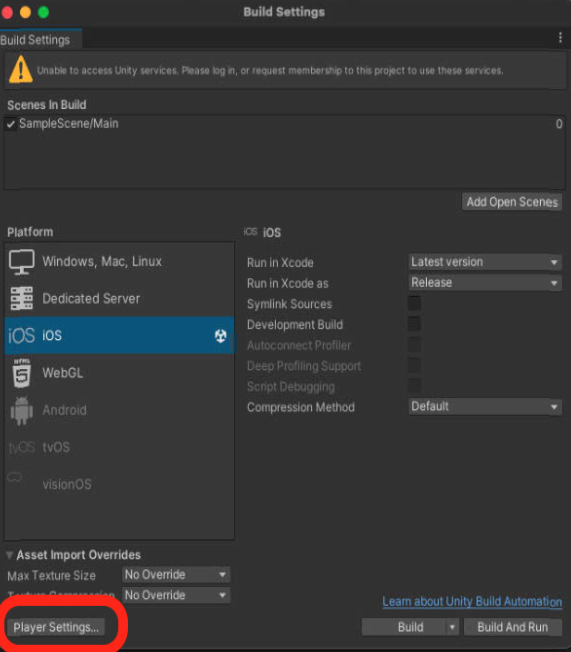

# iOS Framework for Unity

## Unity 呼叫 iOS 方法 

### iOS 端專案
```sh
使用 @_cdecl
```
@_cdecl 名稱要跟 func 名稱一致。
```swift
// 給 Unity 使用的橋接器
public class UnityBridge: NSObject {
    private static var sdk: SDK?  // 我們的 sdk
    public static func initUI(vendorid: String, isDebug: Bool) {...} // 宣告的靜態接口
}

// Unity 主要呼叫的接口 (要寫的部分)
@_cdecl("sdkDidInit")
public func sdkDidInit(_ vendorid: UnsafePointer<CChar>?, _ isDebug: Bool) {
    
    guard let vendorid = vendorid else {
        return
    }
    
    // 呼叫我們 sdk
    UnityBridge.initUI(vendorid: String(cString: vendorid), isDebug: isDebug)
}
```

> 備註：
> <br>
> iOS 端專案特定傳參數需要使用到 c 語言 **UnsafePointer** 類型
> <br>
> ex: string ->  UnsafePointer\<CChar\>

### Unity 端專案

```sh
使用 [DllImport("__Internal")]
```

方法名稱要跟 iOS 端專案 ＠_cdecl 一致。

```c#
[DllImport("__Internal")]
static extern void sdkDidInit(string vendorid, bool isDebug);
```

Unity 該宣告的類別底下，就可以直接使用。

```c#
public void _sdkDidInit(string vendorid, bool isDebug) {
	#if UNITY_IOS && EDITOR_MPLATFORM_IOS
	sdkDidInit(vendorid, isDebug); // 呼叫 sdk 接口方法
	#endif
}
```

<br>
<br>


## Unity callback 給 iOS 使用

### 方法一：.h、.mm 接口處理

在 Unity Project 底下建立 `Assets/Plugins/iOS` 的目錄結構，並新增 `TestSdkUnity.h` 跟 `TestSdkUnity.mm` 兩個檔案，它的用途是要建立 API，可以收字串訊息。

**iOS 端專案**  
```swift
public class UnityBridge: NSObject {
    /// 初始化
    static func initSDK() {
        guard Self.testSDK == nil,
        let rootViewController = UIApplication.shared.windows.first?.rootViewController
        else { return  }
        
        Self.testSDK = .init(rootViewController)
        testSDK?.resultCallBack = { str in
	    // Start - 呼叫委派的地方 (要寫的部分)
            if let result = testSdkResult {
                result(str)
            }
	    // End 
        }
    }

    /// 註冊 framework delegate (要寫的部分)
    /// - Parameter delegate: 回傳格式
    @objc static func reqistrationReplyResult(_ delegate: @escaping (String) -> Void) {
        UnityBridge.testSdkResult = delegate
    }
}

// MARK: Delegates (要寫的部分)
public extension UnityBridge {
    static var testSdkResult: ((String) -> Void)?
}
```


**Unity 端專案**  
底下為 .h、.mm 要處理的接口。
```objc
//
// TestSdkUnity.h
//
#import <Foundation/Foundation.h>
#import <UIKit/UIKit.h>

@interface TestSdkUnity : NSObject

@end

//
// TestSdkUnity.mm
//
#import "TestSdkUnity.h"
/// 此處路徑可拆開 framework/Headers 中取得
#import <TestLoginSdk/TestLoginSdk-Swift.h>
@interface TestSdkUnity ()
@end

@implementation TestSdkUnity

extern "C" {
    typedef void (*ReplyResult)(const char* result);
    void reqistrationReplyResult(ReplyResult value);
}

void reqistrationReplyResult(ReplyResult value){
    /// 這邊要跟swift 制定好的 func 名稱一致
    [UnityBridge reqistrationReplyResult:^(NSString * Result) {
        value((char *)[Result UTF8String]);
    }];
}

@end
```
建立一個 iOSLoginSDK.cs 檔案，它的目的是作為 Unity 端統一收送訊息的角色，其他物件可以透過它送訊息出去，它也要負責將收到的訊息分派給負責的物件。
```C#
public class iOSLoginSDK 
{    
    // 跟 Unity 呼叫 iOS 方法一致，只是傳參數改成閉包類型 (該宣告下方)。
    [DllImport("__Internal")]
    static extern void reqistrationReplyResult(onTestSdkResultType value);

    // 閉包類型 (方法名稱不用一樣，但是傳參數要跟 iOS 端自訂的一樣。)
    private delegate void onTestSdkResultType(string value);
        
    // Unity 接收端 
    // MonoPInvokeCallback 裏面方法要跟閉包類型 (該宣告上方) 名稱要一致。
    [MonoPInvokeCallback(typeof(onTestSdkResultType))]
    public static void TestSdkResult(string value)
    {     
        Debug.Log("This static function has been called from iOS!");
        Debug.Log(value);            
    }

    /// 初始化
    public iOSLoginSDK() 
    {
        /// 註冊回呼
        reqistrationReplyResult(TestSdkResult);
    }
}
```

<br>

### 方法二：不使用 .h、.mm 接口處理

**iOS 端專案**  
```swift
public class UnityBridge: NSObject {
    /// 初始化
    static func initSDK() {
        ...忽略
        testSDK?.resultCallBack = { str in
	    // Start - 呼叫委派的地方 (要寫的部分)
             if let result = testSdkResult,
           	let nsStr = (str as NSString).utf8String { // 字串需要額外轉成 c 
            	    result(nsStr)
        	}
	    // End 
        }
    }
}

/// 註冊 framework delegate (要寫的部分)
/// 直接對應到 Unity 端的 DllImport，方法要一致。
/// - Parameter delegate: 委派
@_cdecl("reqistrationReplyResult")
public func reqistrationReplyResult(delegate: @convention(c) @escaping (UnsafePointer<CChar>) -> Void) { // @convention(c) 回呼是以 c 語言為主，參數類型要改成 c 語言可接受的類型。
    UnityBridge.testSdkResult = delegate
}

// MARK: Delegates (要寫的部分)
public extension UnityBridge {
    static var testSdkResult: ((UnsafePointer<CChar>) -> Void)? // 參數要改成 c 語言可接受的類型
}
```


<br>
<br>


## Building framework

XXX.framework 直接複製到 Unity 專案底下。


<br>
<br>


## framework 放置 Unity 的檔案路徑


<br>
> **目前專案的路徑**  
> <br>
> 

<br>
<br>

## Dynamic frameworks 相關處理

在 unity 專案一欄單擊選擇 framework，右側面板有選項要勾選 (下圖選項)。 


<br>

其他設定參考資料：
* Static and Dynamic libraries/frameworks：[click](https://medium.com/@ji3g4kami/static-and-dynamic-frameworks-824eb82dceb0)
* Import and configure plug-ins：[click](https://docs.unity3d.com/2020.3/Documentation/Manual/PluginInspector.html)

<br>


## xcode 編譯相關設定


<br>

<br>

<br>

<br>
<br>

## 參考資料

* https://betterprogramming.pub/setting-up-ios-framework-for-unity-9ef4e577db89
* https://medium.com/@f_yuki/create-an-ios-native-plugin-for-unity-using-swift-bc27e3634339
