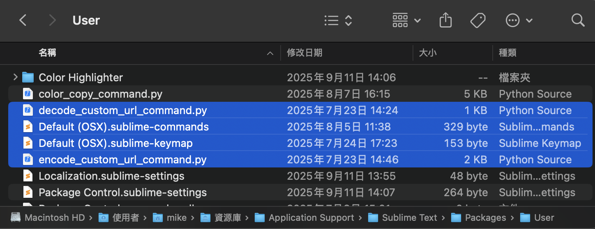
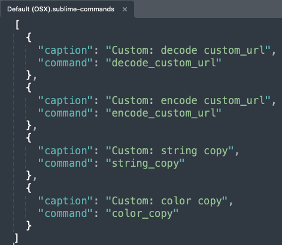
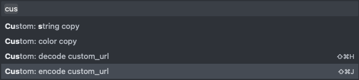
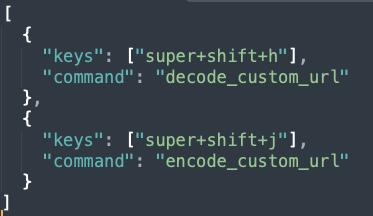

## Sublime Text 外掛程式教學
<br />


### 建立外掛檔案


Sublime Text 的外掛程式本質上就是一個 Python 檔案 (`.py`)。
1. 開啟 Sublime Text。
2. 點選選單列的 `Tools` -> `Developer` -> `New Plugin...`。


這會自動生成一個基本的 .py 檔案範本，並包含 sublime_plugin 的基本結構。


```python
import sublime
import sublime_plugin

class ExampleCommand(sublime_plugin.TextCommand):
    def run(self, edit):
        self.view.insert(edit, 0, "Hello, World!")
```

### 儲存檔案

將 .py 檔案儲存到 Sublime Text 的 `Packages` 資料夾中。這個資料夾通常位於：

- macOS: `~/Library/Application Support/Sublime Text/Packages/User/`
- Windows: `%APPDATA%\Sublime Text\Packages\User/`


Sublime Text 的核心機制就是自動化。當你把一個 Python 檔儲存到 `Packages/User` 資料夾時，Sublime 會：
1. 讀取檔案：它會掃描這個資料夾中的所有 `.py` 檔案。
2. 尋找 TextCommand 或其他指令類別：它會找到所有繼承了 `sublime_plugin.TextCommand`、`sublime_plugin.WindowCommand` 等指令類別的類別。
3. 自動註冊：Sublime 會自動註冊這些類別，並將它們的名稱轉換為可執行的指令。

`command` 與檔案名稱：
- 如果你的類別名稱是 `MyCustomCommand`，指令名稱就是 `my_custom`，檔名建議 `my_custom_command.py`。
- 如果你的類別名稱是 `ExampleCommand`，指令名稱就是 `example`，檔名建議 `example_command.py`。

這個指令會與它的 Python 檔案綁定，並且可以在任何視窗或檔案中被執行。




### 如何使用外掛


#### 指令面板（Command Palette）
- 設定
1. 開啟儲存檔案的路徑
2. 查看 `Default (OSX).sublime-commands` 是否存在，若不存在需要手動建立一份檔案。
3. 設定需要的 command，command 名稱如上面所說的 `指令名稱`，而 `caption` 名稱建議加前綴，這樣會比較好搜尋。


- 使用方法
1. 按下 `Ctrl+Shift+P (Windows/Linux)` 或 `Cmd+Shift+P (macOS)`。
2. 輸入你的 `caption` 名稱 (參考設定的文案)。

3. 按 `Enter` 執行

#### 快捷鍵（Key Binding）
- 設定
1. 開啟儲存檔案的路徑
2. 查看 `Default (OSX).sublime-keymap` 是否存在，若不存在需要手動建立一份檔案。
3. 設定需要的 command，command 名稱如上面所說的 `指令名稱`，而 `keys` 設定快捷鍵，盡量不要跟原本衝突。


- 使用方法
1. 直接使用 `keys` 設定的快捷鍵執行

</br>
</br>
</br>


